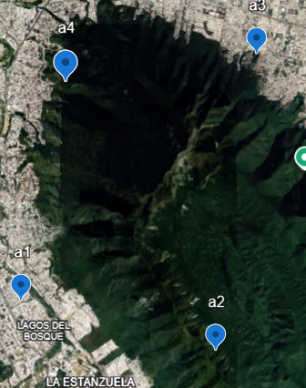
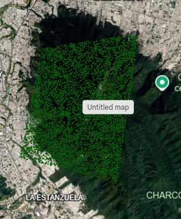
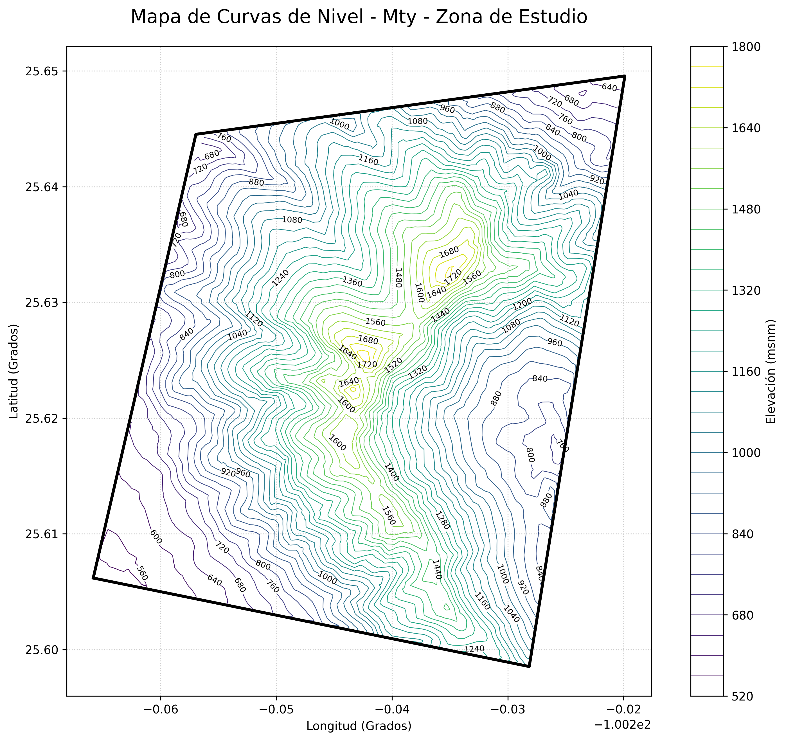
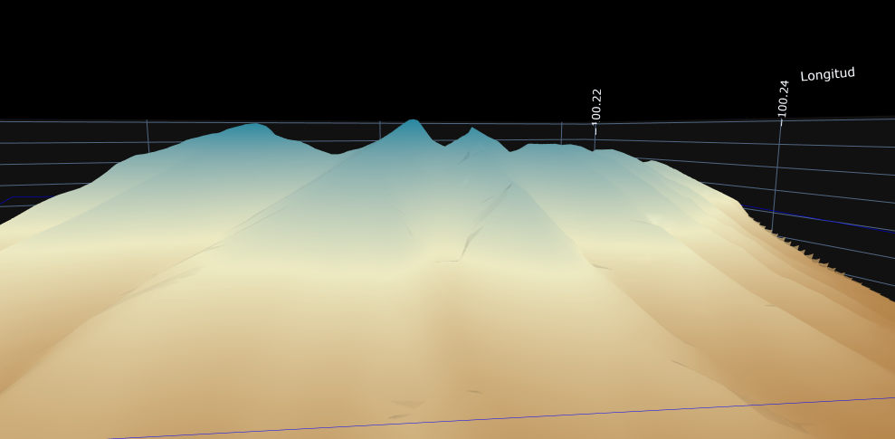

# GeoReconstruct3D

### Sparse Terrain Reconstruction Engine

##  Overview

GeoReconstruct3D is a geospatial modeling system capable of reconstructing terrain surfaces from a minimal set of spatial points.

Using interpolation techniques and Monte Carlo simulation, the system generates:

* Terrain surface approximations
* Contour lines (isolines)
* 3D terrain models

This project demonstrates how complex geographic structures can be inferred from sparse data.

---

##  Descripción

GeoReconstruct3D es un sistema de modelado geoespacial capaz de reconstruir superficies de terreno a partir de un conjunto mínimo de coordenadas.

Utilizando técnicas de interpolación y simulación Monte Carlo, el sistema genera:

* Aproximaciones de superficie
* Curvas de nivel
* Modelos 3D del terreno

Este proyecto demuestra cómo es posible inferir estructuras geográficas complejas a partir de datos limitados.

---

##  Problem / Problema

**EN:**
Traditional terrain modeling requires large datasets (e.g., LiDAR, DEMs), which are not always available.

**ES:**
El modelado tradicional de terreno requiere grandes volúmenes de datos (como LiDAR o modelos digitales de elevación), los cuales no siempre están disponibles.

---

##  Solution / Solución

**EN:**
This system reconstructs terrain using sparse spatial data through interpolation and stochastic sampling.

**ES:**
Este sistema reconstruye el terreno utilizando datos espaciales limitados mediante interpolación y muestreo estocástico.

---

##  Case Study / Caso de Estudio

**Cerro de la Silla – Monterrey, Nuevo León**

The terrain was reconstructed using only a small set of spatial points.

El terreno fue reconstruido utilizando un conjunto reducido de coordenadas.

---

##  Workflow / Flujo de Trabajo

### 1. Input Points / Puntos de Entrada

Minimal spatial mapping (as few as 3–4 points)

Mapeo mínimo del terreno (3–4 puntos)

---

### 2. Monte Carlo Simulation / Simulación Monte Carlo

Random sampling improves terrain approximation

Muestreo aleatorio para mejorar la estimación del terreno

---

### 3. Contour Generation / Curvas de Nivel

Elevation isolines are generated

Generación de isolíneas de elevación

---

### 4. 3D Surface Modeling / Modelado 3D

Final terrain reconstruction

Reconstrucción final del terreno en 3D

##  Technologies / Tecnologías

* Python
* NumPy
* Pandas
* Matplotlib
* GeoPandas

---

##  Key Concepts / Conceptos Clave

* Spatial interpolation
* Monte Carlo simulation
* Surface reconstruction
* Geospatial visualization

---

##  Applications / Aplicaciones

* Terrain modeling in low-data environments
* Geographic analysis
* Environmental modeling
* Educational tools

---

##  Future Work / Trabajo Futuro

* Integration with DEM datasets
* Interactive visualization (Plotly)
* Algorithm optimization

---

##  Author

Jose Aron Salgado Ramirez Geospatial Developer & Data Science Enthusiast

---

> *"Reconstructing terrain from minimal data is not just a constraint — it's a way to understand the structure of space."*

# Automatic NaN handling for sea-level consistency
grid_z = np.nan_to_num(grid_z, nan=0.0)
